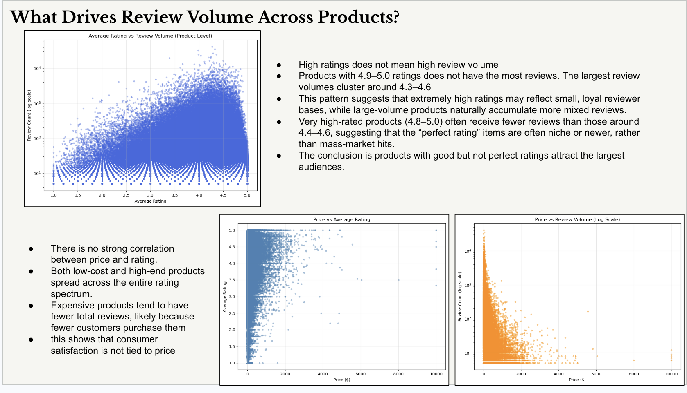
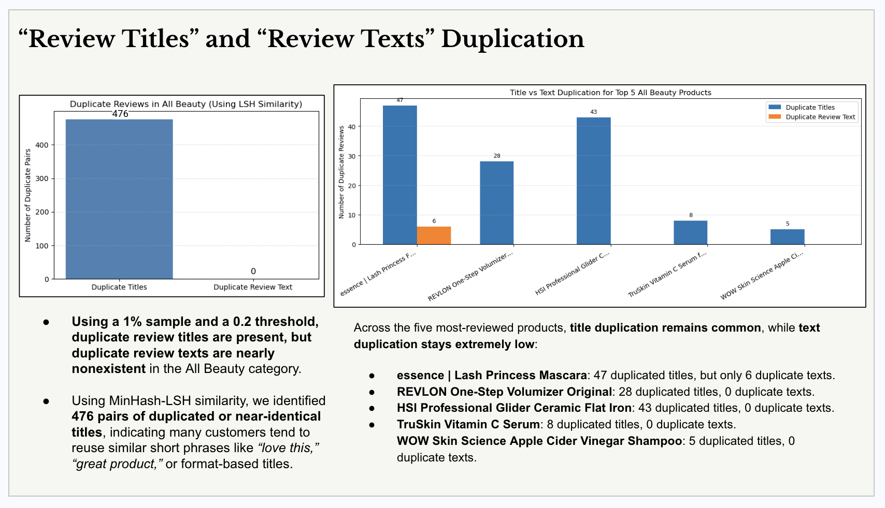
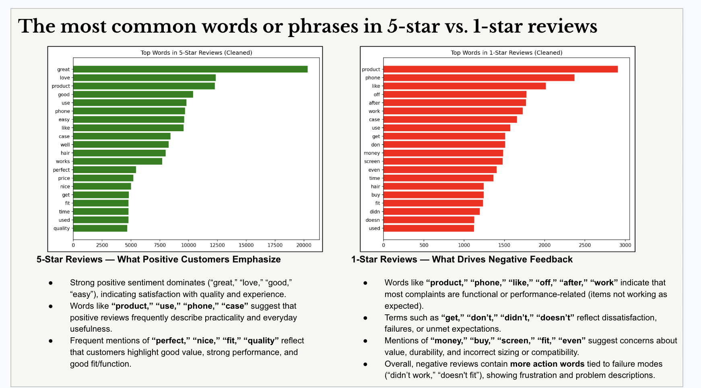

# Amazon Reviews Big Data Similarity Analysis

This repo contains the code for my Big Data and Cloud Computing final project, completed as part of coursework at the **University of Chicago**. I worked with a very large Amazon Reviews Archive: approximately **65 million customer reviews** and about **52.4 GiB** of nested review and product metadata stored in Google Cloud Storage.

The main deliverable in this repo is the Jupyter notebook. The presentation is included as a summary of results, but the important part is the data engineering and analysis pipeline built in PySpark: reading cloud-hosted Parquet data, cleaning and joining large nested datasets, saving intermediate outputs, running distributed aggregations, and applying similarity analysis to review text.

## What I Built

I built an end-to-end big data workflow that:

- Ingests Amazon review and metadata Parquet files directly from Google Cloud Storage.
- Uses Spark DataFrames and Spark SQL functions to inspect, clean, filter, and transform large-scale review data.
- Flattens nested product metadata and joins it with review-level data using product identifiers.
- Removes low-quality records, invalid product IDs, unrealistic text lengths, and unusable price values.
- Saves a cleaned joined dataset back to cloud storage as Parquet so later analysis does not need to reread and reprocess the raw source files.
- Performs exploratory analysis on review timelines, category-level volume, top-reviewed products, ratings, prices, and reviewer behavior.
- Uses text cleaning, tokenization, n-grams, hashing, and MinHash-LSH to detect duplicated or near-duplicated review titles and review texts.
- Produces presentation-ready visualizations from Spark outputs after converting targeted aggregated results to pandas.

## Dataset Scale

The project was designed for a dataset too large to analyze comfortably with local pandas-only workflows:

- Approximately **65 million customer reviews**
- Approximately **52.4 GiB** of source data
- Nested Parquet review and metadata files
- Cloud storage source paths:
  - `gs://msca-bdp-data-open/final_project_reviews/reviews_parquet`
  - `gs://msca-bdp-data-open/final_project_reviews/meta_parquet`

The raw data is not included in this repo because it is too large for GitHub. The code is written to read from the original cloud storage location used for the course project.

## Technical Stack

- **Google Cloud Storage** for source data and intermediate Parquet outputs
- **Google Cloud Dataproc / Spark environment** for distributed processing
- **Apache Spark / PySpark** for large-scale data ingestion, transformation, joins, filtering, and aggregation
- **Spark DataFrames** and `pyspark.sql.functions` for column operations and data quality checks
- **Parquet** for efficient cloud-native storage of raw and cleaned data
- **Spark MLlib** for text similarity modeling
- **RegexTokenizer**, **NGram**, **HashingTF**, and **MinHashLSH** for duplicate and near-duplicate review detection
- **pandas** and **NumPy** for smaller post-aggregation analysis
- **Matplotlib** and **Seaborn** for visualization
- **Jupyter Notebook** for development, analysis, and reproducible project documentation

## Repository Contents

```text
.
├── assets/
│   ├── review-title-text-duplication.png
│   ├── review-volume-drivers.png
│   └── star-rating-common-words.png
├── notebooks/
│   └── amazon_reviews_analysis.ipynb
├── presentation/
│   └── amazon_reviews_final_project.pdf
├── .gitignore
├── README.md
└── requirements.txt
```

## Code Workflow

The notebook follows a cloud-first big data workflow:

1. **Load raw source data**

   The notebook reads the reviews and metadata datasets from GCS using Spark:

   - `reviews_parquet`
   - `meta_parquet`

2. **Inspect data quality**

   I created missingness and cardinality summaries to understand which fields were usable, sparse, duplicated, or too noisy for analysis.

3. **Clean and flatten**

   I selected the useful review and metadata fields, flattened nested structures where needed, cleaned text fields, standardized prices, filtered invalid values, and prepared product-level metadata for joining.

4. **Join reviews with product metadata**

   The cleaned review and metadata tables are joined on product identifiers so review text, ratings, timestamps, product titles, categories, and prices can be analyzed together.

5. **Persist cleaned data**

   After cleaning and joining, I wrote the cleaned base table back to GCS as Parquet:

   ```text
   gs://msca-bdp-students-bucket/shared_data/ynmao/base_clean.parquet
   ```

   This was important because the dataset is large. Saving intermediate results made the rest of the notebook faster and avoided repeatedly recomputing the full pipeline from raw data.

6. **Run EDA at scale**

   I used Spark aggregations to analyze:

   - Review volume over time
   - Top 10 products by review count
   - Product review trends by month
   - Review volume across categories
   - Category seasonality and spikes
   - Rating distribution
   - Price vs. average rating
   - Price vs. review volume
   - Average rating vs. review volume
   - Most active reviewers and category diversity

7. **Run text similarity analysis**

   For the duplication analysis, I focused on the All Beauty category and used Spark MLlib to tokenize review titles and review text, generate n-grams, hash text features, and apply MinHash-LSH for approximate similarity matching.

## Selected Visuals

### What Drives Review Volume Across Products?



This analysis showed that extremely high ratings do not automatically mean high review volume. The largest review volumes cluster around products with strong but not perfect average ratings, roughly in the 4.3 to 4.6 range. Price also did not show a strong relationship with rating, while expensive products generally had fewer total reviews.

### Review Title and Review Text Duplication



Using MinHash-LSH on a sampled All Beauty dataset, I found **476 pairs of duplicated or near-identical review titles**, while duplicate full review texts were nearly nonexistent. This suggests that short review titles are much more likely to repeat than full review bodies.

### Common Words in 5-Star vs. 1-Star Reviews



The 5-star reviews leaned toward positive quality and usability words such as "great," "love," "good," and "easy." The 1-star reviews contained more functional complaint language, with terms related to product failure, usability issues, compatibility, and unmet expectations.

## Key Takeaways

- The project required distributed processing because the dataset contained around **65 million reviews**, not just a small CSV sample.
- Spark was used for the parts that needed scale: loading Parquet, joining review and metadata tables, cleaning records, aggregating trends, and preparing text fields.
- Intermediate cloud storage was important. Writing the cleaned joined dataset to Parquet made the workflow much more practical.
- Review volume was not simply driven by perfect ratings. Products with good but not perfect ratings tended to have the largest audiences.
- Duplicate title patterns were easier to find than duplicate full-text reviews, which may mean exact copy-paste behavior is less common in full review bodies or harder to detect with simple similarity thresholds.
- The code demonstrates both data engineering and analysis: cloud ingestion, Spark transformations, data quality checks, aggregation, visualization, and machine learning-based similarity detection.

## How To Run

This notebook is intended to run in a Spark environment with access to the course Google Cloud Storage buckets.

Install local notebook dependencies:

```bash
pip install -r requirements.txt
```

Open the notebook:

```bash
jupyter notebook notebooks/amazon_reviews_analysis.ipynb
```

The Spark and GCS portions require a configured cloud environment such as Dataproc or another PySpark setup with access to the source buckets.

## Presentation

The PDF presentation is included here:

```text
presentation/amazon_reviews_final_project.pdf
```

It summarizes the final findings, but the notebook is the primary technical artifact because it contains the full big data processing and analysis workflow.
